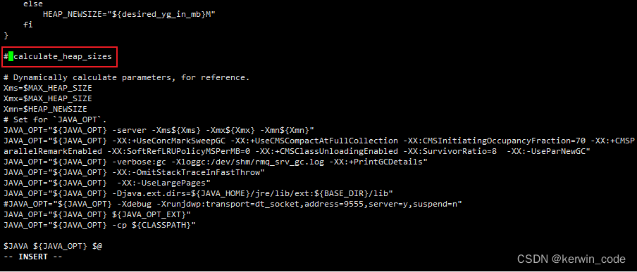

# MQ
RocketMQ适用于大规模分布式系统，需要高吞吐量、可靠性和事务支持的场景。而RabbitMQ适用于实时性要求较高的场景，对消息可靠性要求相对较低的场景 
## rocketMq安装
https://blog.csdn.net/weixin_44606481/article/details/129780540
- 使用docker安装并准备配置文件
RocketMQ服务镜像 docker pull apache/rocketmq:5.1.0
RocketMQ控制台镜像 docker pull apacherocketmq/rocketmq-dashboard:latest
- 创建需要挂载的文件夹和文件
  创建挂载文件夹
```
# 日志目录
mkdir /usr/local/rocketmq/nameserver/logs -p
# 脚本目录
mkdir /usr/local/rocketmq/nameserver/bin -p
```
- 设置权限：如果不设置会导致NameServer容器内部无法写日志文件
```
# 777 文件所属者、文件所属组和其他人有读取 & 写入 & 执行全部权限。rwxrwxrwx
chmod 777 -R /usr/local/rocketmq/nameserver/*
```

- 创建挂载文件
> NameServer启动脚本中有一个自动计算最大堆内存和新生代内存的函数会导致在不同硬件环境下设置最大堆内存和新生代内存环境变量不被应用，，这里先提前copy一份容器内部启动脚本做挂载，如果想自定义内存可以自己调整。

1. 启动容器
    ```
    docker run -d \
     --privileged=true \
     --name rmqnamesrv \
    apache/rocketmq:5.1.0 sh mqnamesrv
    ```
2. 复制容器内启动脚本到挂载目录/usr/local/rocketmq/nameserver/bin
   ```
     docker cp rmqnamesrv:/home/rocketmq/rocketmq-5.1.0/bin/runserver.sh /usr/local/rocketmq/nameserver/bin/runserver.sh
   ```
3. 修改runserver.sh
   ```
     # 打开脚本文件
     vi /usr/local/rocketmq/nameserver/bin/runserver.sh
   ```
   找到调用calculate_heap_sizes函数的位置注释掉保存即可，拉到脚本最底部就能找到
  
4. 停止&删除容器 
   ```
   docker stop rmqnamesrv
   docker rm rmqnamesrv
   ```

### docker compose 安装
- 创建Broker需要挂载的文件夹和文件
```
# 创建需要的挂载目录
mkdir /usr/local/rocketmq/broker/logs -p \
mkdir /usr/local/rocketmq/broker/data -p \
mkdir /usr/local/rocketmq/broker/conf -p \
mkdir /usr/local/rocketmq/broker/bin -p 
```
- 设置权限
```
# 777 文件所属者、文件所属组和其他人有读取 & 写入 & 执行全部权限。rwxrwxrwx
chmod 777 -R /usr/local/rocketmq/broker/*
```
- 创建broker.conf文件
   在/usr/local/rocketmq/broker/conf文件夹下创建broker.conf文件
   ```
   vi /usr/local/rocketmq/broker/conf/broker.conf
   ```
   添加以下配置信息到broker.conf，这里不对参数做过多的说明，在下面Broker配置详解中有对Broker常用参数做详细介绍(注意换成自己本地的IP)
  ```
  # 集群名称
  brokerClusterName = DefaultCluster
  # 节点名称
  brokerName = broker-a
  # broker id节点ID， 0 表示 master, 其他的正整数表示 slave，不能小于0 
  brokerId = 0
  # Broker服务地址	String	内部使用填内网ip，如果是需要给外部使用填公网ip
  brokerIP1 = 192.168.10.220
  # Broker角色
  brokerRole = ASYNC_MASTER
  # 刷盘方式
  flushDiskType = ASYNC_FLUSH
  # 在每天的什么时间删除已经超过文件保留时间的 commit log，默认值04
  deleteWhen = 04
  # 以小时计算的文件保留时间 默认值72小时
  fileReservedTime = 72
  # 是否允许Broker 自动创建Topic，建议线下开启，线上关闭
  autoCreateTopicEnable=true
  # 是否允许Broker自动创建订阅组，建议线下开启，线上关闭
  autoCreateSubscriptionGroup=true 
  ```
  说明：建立broker.conf文件，通过这个文件把RocketMQ的broker管理起来

- 编写docker-compose.yml文件
进入/usr/local/rocketmq目录，创建docker-compose.yml文件，将下面的编排信息写入
```
cd /usr/local/rocketmq
vi docker-compose.yml
```
```
version: '3.8'
services:
  rmqnamesrv:
    image: apache/rocketmq:5.1.0
    container_name: rmqnamesrv
    ports:
      - 9876:9876
    restart: always
    privileged: true
    volumes:
      - /usr/local/rocketmq/nameserver/logs:/home/rocketmq/logs
      - /usr/local/rocketmq/nameserver/bin/runserver.sh:/home/rocketmq/rocketmq-5.1.0/bin/runserver.sh
    environment:
      - MAX_HEAP_SIZE=256M
      - HEAP_NEWSIZE=128M
    command: ["sh","mqnamesrv"]
  broker:
    image: apache/rocketmq:5.1.0
    container_name: rmqbroker
    ports:
      - 10909:10909
      - 10911:10911
    restart: always
    privileged: true
    volumes:
      - /usr/local/rocketmq/broker/logs:/home/rocketmq/logs
      - /usr/local/rocketmq/broker/store:/home/rocketmq/logs
      - /usr/local/rocketmq/broker/conf/broker.conf:/home/rocketmq/broker.conf
      - /usr/local/rocketmq/broker/bin/runbroker.sh:/home/rocketmq/rocketmq-5.1.0/bin/runbroker.sh
    depends_on:
      - 'rmqnamesrv'
    environment:
      - NAMESRV_ADDR=rmqnamesrv:9876
      - MAX_HEAP_SIZE=512M
      - HEAP_NEWSIZE=256M
    command: ["sh","mqbroker","-c","/home/rocketmq/broker.conf"]
  rmqdashboard:
    image: apacherocketmq/rocketmq-dashboard:latest
    container_name: rocketmq-dashboard
    ports:
      - 8080:8080
    restart: always
    privileged: true
    depends_on:
      - 'rmqnamesrv'
    environment:
      - JAVA_OPTS= -Xmx256M -Xms256M -Xmn128M -Drocketmq.namesrv.addr=rmqnamesrv:9876 -Dcom.rocketmq.sendMessageWithVIPChannel=false
```

- 启动服务
```
# docker Compose v2版本命令
docker compose up -d #  -d 指后台运行
```
- 放行8080端口,启动成功访问控制台
http://192.168.10.220:8080


- Broker配置详解
```
# nameServer 地址多个用;隔开 默认值null
# 例：127.0.0.1:6666;127.0.0.1:8888 
namesrvAddr = 127.0.0.1:6666
# 集群名称 单机配置可以随意填写，如果是集群部署在同一个集群中集群名称必须一致类似Nacos的命名空间
brokerClusterName = DefaultCluster
# broker节点名称 单机配置可以随意填写，如果是集群部署在同一个集群中节点名称不要重复
brokerName = broker-a
# broker id节点ID， 0 表示 master, 其他的正整数表示 slave，不能小于0 
brokerId = 0
# Broker 对外服务的监听端口 默认值10911
# 端口（注意：broker启动后，会占用3个端口，分别在listenPort基础上-2，+1，供内部程序使用，所以集群一定要规划好端口，避免冲突）
listenPort=10911
# Broker服务地址	String	内部使用填内网ip，如果是需要给外部使用填公网ip
brokerIP1 = 127.0.0.1
# BrokerHAIP地址，供slave同步消息的地址 内部使用填内网ip，如果是需要给外部使用填公网ip
brokerIP2 = 127.0.0.1

# Broker角色 默认值ASYNC_MASTER
# ASYNC_MASTER 异步复制Master，只要主写成功就会响应客户端成功，如果主宕机可能会出现小部分数据丢失
# SYNC_MASTER 同步双写Master，主和从节点都要写成功才会响应客户端成功，主宕机也不会出现数据丢失
# SLAVE
brokerRole = ASYNC_MASTER
# 刷盘方式
# SYNC_FLUSH（同步刷新）相比于ASYNC_FLUSH（异步处理）会损失很多性能，但是也更可靠，所以需要根据实际的业务场景做好权衡，默认值ASYNC_FLUSH
flushDiskType = ASYNC_FLUSH
# 在每天的什么时间删除已经超过文件保留时间的 commit log，默认值04
deleteWhen = 04
# 以小时计算的文件保留时间 默认值72小时
fileReservedTime = 72

# 消息大小 单位字节 默认1024 * 1024 * 4
maxMessageSize=4194304

# 在发送消息时，自动创建服务器不存在的Topic，默认创建的队列数，默认值4
defaultTopicQueueNums=4
# 是否允许Broker 自动创建Topic，建议线下开启，线上关闭
autoCreateTopicEnable=true
# 是否允许Broker自动创建订阅组，建议线下开启，线上关闭
autoCreateSubscriptionGroup=true

# 失败重试时间，默认重试16次进入死信队列，第一次1s第二次5s以此类推。
# 延时队列时间等级默认18个，可以设置多个比如在后面添加一个1d(一天)，使用的时候直接用对应时间等级即可,从1开始到18，如果添加了第19个直接使用等级19即可
messageDelayLevel=1s 5s 10s 30s 1m 2m 3m 4m 5m 6m 7m 8m 9m 10m 20m 30m 1h 2h

# 指定TM在20秒内应将最终确认状态发送给TC，否则引发消息回查。默认为60秒
transactionTimeout=20
# 指定最多回查5次，超过后将丢弃消息并记录错误日志。默认15次。
transactionCheckMax=5
# 指定设置的多次消息回查的时间间隔为10秒。默认为60秒。
transactionCheckInterval=10 
```